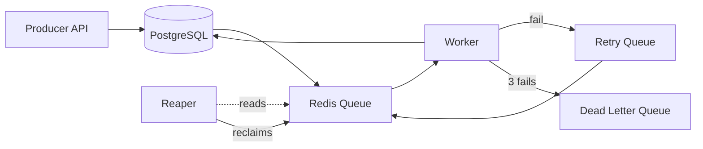
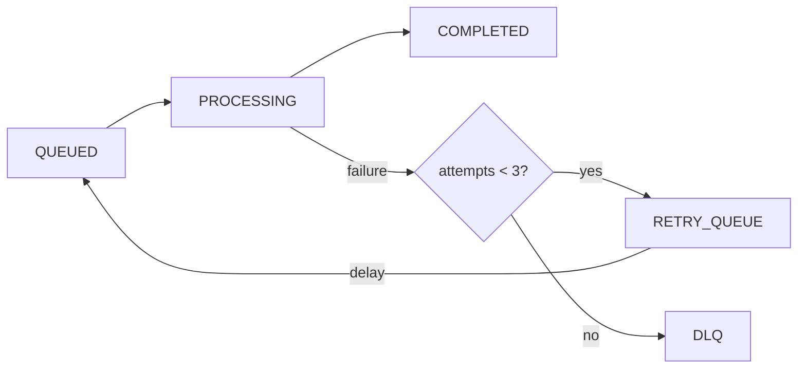

# Distributed Job Processing System


---

## Overview

A fault-tolerant distributed job processing system built with Spring Boot, Redis, and PostgreSQL.

This system is designed to reliably process background tasks with support for retries, crash recovery, and dead-letter handling. PostgreSQL acts as the source of truth, while Redis provides high-speed queue operations.

---

## Architecture



---

## Redis Data Model

| Key                 | Type | Purpose                                   |
| ------------------- | ---- |-------------------------------------------|
| `job_queue`         | List | Jobs waiting for processing               |
| `processing_queue`  | List | Active jobs (reaper boundary)             |
| `retry_queue`       | ZSET | Delayed retries (score = retry timestamp) |
| `dead_letter_queue` | List | Failed after retry limit                  |
| `job:{id}`          | Hash | Job metadata                              |

---

## Key Features

* **Atomic Job Claiming**\
  Uses Redis `BLMOVE` to ensure jobs are processed by only one worker.

* **Fault-Tolerant Processing**\
  Jobs are persisted in PostgreSQL before entering the queue.

* **Retry with Backoff**\
  Failed jobs are retried with increasing delay using a Redis sorted set.

* **Dead Letter Queue (DLQ)**\
  Jobs exceeding retry limits are moved to DLQ for inspection.

* **Crash Recovery (Reaper)**\
  Detects and reclaims jobs stuck in processing due to worker crashes.

* **Separation of Concerns**\
  Producer and Worker run as separate services using Spring profiles.

---

## Job Lifecycle



---

## Tech Stack

* **Backend:** Spring Boot
* **Database:** PostgreSQL
* **Queue Layer:** Redis (Jedis)
* **Frontend:** Thymeleaf (Dashboard)
* **Containerization:** Docker & Docker Compose

---

## Getting Started

### Prerequisites

* Java 21+
* Maven
* Docker
* Redis (cloud instance)

> [!CAUTION]
> This project currently uses a cloud Redis instance (Upstash). \
> Configure Redis host, port, and password in application.properties or environment variables before running.


### Setup

```bash
git clone https://github.com/rnavxn/dist-job-processor.git
cd dist-job-processor
```

### Run with Docker

```bash
docker-compose up --build
```

### API Example

Access API: `http://localhost:8080`


```bash
# Enqueue a job
curl -s -X POST "http://localhost:8080/api/jobs/enqueue?type=EMAIL_SEND&payload=test"
```

---

## Limitations & Tradeoffs

* **Dual-write inconsistency risk**\
  PostgreSQL and Redis writes are not atomic, which may lead to rare inconsistencies.

* **No idempotency guarantees**\
  In failure scenarios (e.g., worker crash after execution but before DB update), jobs may be reprocessed.

* **Basic crash recovery strategy**\
  Reaper scans the processing queue periodically instead of using heartbeat-based tracking.

* **Limited observability**\
  Metrics and monitoring (e.g., Prometheus/Grafana) are not yet integrated.

---

## Future Improvements

* Add reconciliation service for Redis/PostgreSQL consistency
* Introduce idempotency keys for safe reprocessing
* Implement visibility timeout + heartbeat mechanism
* Add metrics and monitoring (Prometheus + Grafana)
* Optimize reaper with batching strategy

---

## License

This project is licensed under the MIT License.
