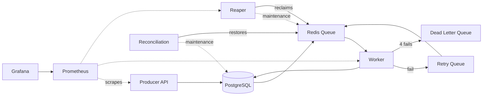
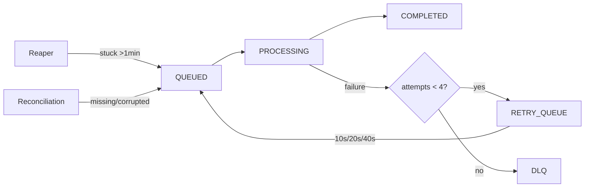

# Distributed Job Processing System


---

## Table of Contents

- [Overview](#overview)
- [Architecture](#architecture)
- [Service Separation](#service-separation)
- [Redis Data Model](#redis-data-model)
- [Key Features](#key-features)
- [Job Lifecycle](#job-lifecycle)
- [Metrics](#metrics)
- [Tech Stack](#tech-stack)
- [Getting Started](#getting-started)
- [Limitations & Tradeoffs](#limitations--tradeoffs)
- [Future Improvements](#future-improvements)
---

## Overview

A production-ready distributed job processing system built with Spring Boot, Redis, and PostgreSQL.

This system is designed to reliably process background tasks with support for automatic retries, crash recovery, 
dead-letter handling, and self-healing consistency. PostgreSQL acts as the source of truth, while Redis provides 
high-speed queue operations with automatic memory management. Real-time metrics are exposed via Micrometer and 
scraped by Prometheus, with a Grafana dashboard for live observability.

---

## Architecture



---

## Service Separation

| Service             | Profile       | Container          | Purpose                                          |
|---------------------|---------------|--------------------|--------------------------------------------------|
| Producer            | `producer`    | producer           | REST API, job enqueue                            |
| Worker              | `worker`      | worker-1, worker-2 | Job processing, retry scheduling                 |
| Maintenance         | `maintenance` | maintenance        | Crash recovery, consistency checks               |
| Prometheus          | -             | prometheus         | Metrics scraping from all services               |
| Grafana             | -             | grafana            | Live dashboard — queue depth, throughput, health |
| Redis Exporter      | -             | redis-exporter     | Exposes Redis metrics                            |
| PostgreSQL Exporter | -             | postgres-exporter  | Exposes database metrics                         |

---

## Redis Data Model

| Key                 | Type  | Purpose                                   |
|---------------------|-------|-------------------------------------------|
| `job_queue`         | List  | Jobs waiting for processing               |
| `processing_queue`  | List  | Active jobs (reaper boundary)             |
| `retry_queue`       | ZSET  | Delayed retries (score = retry timestamp) |
| `dead_letter_queue` | List  | Failed after retry limit                  |
| `job:{id}`          | Hash  | Job metadata                              |

---

## Key Features

### Production Hardening
- **Self-Healing Consistency**\
  Reconciliation service runs every 30 seconds to ensure Redis and PostgreSQL are in sync, automatically restoring missing or corrupted job metadata.

- **Atomic Operations**\
  All critical queue transfers use Lua scripts to prevent race conditions and data loss.

- **Memory Safety**\
  Completed jobs auto-expire after 1 hour, DLQ jobs after 7 days. Redis memory limits prevent OOM crashes.

- **Fault-Tolerant Processing**\
  Jobs are persisted in PostgreSQL before entering Redis queue. If Redis crashes, reconciliation restores all jobs.

- **Observability**\
  Custom Micrometer metrics expose job lifecycle events (enqueued, completed, failed, retried, recovered) and live queue depths as Prometheus gauges. Grafana dashboard provides real-time visibility into throughput, failure rate, processing latency, and service health across all containers.

### Core Features
- **Atomic Job Claiming**\
  Uses Redis `BLMOVE` to ensure jobs are processed by only one worker.

- **Exponential Backoff**\
  Failed jobs retry with increasing delays (10s → 20s → 40s) to prevent system overload.

- **Dead Letter Queue (DLQ)**\
  Jobs exceeding retry limits (4 attempts) are moved to DLQ for manual inspection.

- **Crash Recovery (Reaper)**\
  Detects and reclaims jobs stuck in processing due to worker crashes (15s interval).

- **Lock Conflict Handling**\
  When multiple workers compete for the same job, losers are moved to retry queue with jitter (2-5s) instead of dropping.

---

## Job Lifecycle



---

## Metrics

Custom metrics tracked via Micrometer and exported to Prometheus:

| Metric                                    | Type    | Description                                    |
|-------------------------------------------|---------|------------------------------------------------|
| `job_enqueued_total`                      | Counter | Jobs submitted to the queue                    |
| `job_completed_total`                     | Counter | Jobs successfully processed                    |
| `job_failed_total`                        | Counter | Jobs that threw an error                       |
| `job_retried_total`                       | Counter | Jobs moved back to queue after failure         |
| `job_dlq_total`                           | Counter | Jobs permanently moved to DLQ                  |
| `job_recovered_total`                     | Counter | Stuck jobs reclaimed by Reaper                 |
| `reconciliation_missing_jobs_total`       | Counter | Jobs restored to Redis by reconciliation       |
| `reconciliation_corrupted_metadata_total` | Counter | Corrupted job metadata fixed by reconciliation |
| `job_queue_depth`                         | Gauge   | Live count of jobs waiting in main queue       |
| `job_processing_queue_depth`              | Gauge   | Live count of jobs being processed             |
| `job_retry_queue_depth`                   | Gauge   | Live count of jobs pending retry               |
| `job_dlq_depth`                           | Gauge   | Live count of jobs in DLQ                      |
| `job_processing_time_seconds`             | Timer   | Processing duration histogram                  |

Grafana dashboard available at `http://localhost:3000` (admin/admin).

---
## Live Dashboard

## System Demo
Check out the distributed queue in action (22s condensed view):

https://github.com/user-attachments/assets/5aac0359-05ce-4080-bb65-35ce11eeb2af

### Dashboard Panels

| Category           | Key Metrics Monitored                 | What it tracks for the system                                                                      |
|--------------------|---------------------------------------|----------------------------------------------------------------------------------------------------|
| **Queue Depths**   | Main, Processing, Retry, DLQ          | Real-time bottleneck detection and load distribution across all job states.                        |
| **Performance**    | Job Throughput, Processing Time       | Measures system capacity, execution latency, and worker efficiency.                                |
| **Reliability**    | Success/Failure Ratio, DLQ Rate       | The overall health and error rates of the tasks being processed.                                   |
| **Self-Healing**   | Recovery Activity, Consistency Issues | **Crucial:** Tracks the Reaper and Reconciliation services actively fixing stuck or orphaned jobs. |
| **Infrastructure** | Service Health                        | Live up/down status of PostgreSQL, Redis, and all Worker/Producer containers.                      |

---

## Tech Stack

* **Backend:** Spring Boot, Java 21
* **Database:** PostgreSQL (source of truth)
* **Queue Layer:** Redis 7 with Jedis
* **Metrics:** Micrometer + Spring Boot Actuator → Prometheus → Grafana
* **Containerization:** Docker & Docker Compose
* **Build Tool:** Maven

---

## Getting Started

### Prerequisites

* Java 21+
* Maven
* Docker & Docker Compose

### Setup

```bash
git clone https://github.com/rnavxn/dist-job-processor.git
cd dist-job-processor
```

### Run with Docker

```bash
docker-compose up --build
```

### Endpoints

| Service           | URL                     |
|-------------------|-------------------------|
| Producer API      | `http://localhost:8080` |
| Grafana Dashboard | `http://localhost:3000` |
| Prometheus        | `http://localhost:9090` |

```bash
# Enqueue a job
curl -s -X POST "http://localhost:8080/api/jobs/enqueue?type=EMAIL_SEND&payload=test"
```

---

## Limitations & Tradeoffs

* **Basic crash recovery strategy**\
  Reaper scans the processing queue periodically instead of using heartbeat-based tracking.

---

## Future Improvements

* [x] Add reconciliation service for Redis/PostgreSQL consistency
* [x] Add metrics and monitoring (Prometheus + Grafana)
* [x] Optimize reaper with batching strategy
* [x] Introduce idempotency keys for safe reprocessing
* [ ] Implement visibility timeout + heartbeat mechanism

---

## License

This project is licensed under the MIT License.