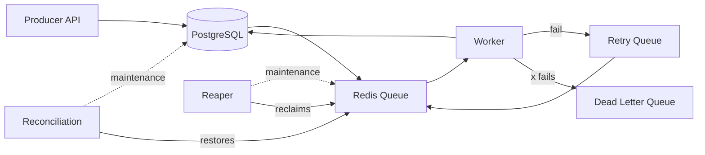
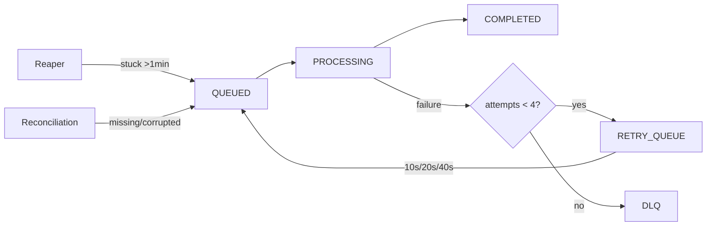

# Distributed Job Processing System


---

## Overview

A production-ready distributed job processing system built with Spring Boot, Redis, and PostgreSQL.

This system is designed to reliably process background tasks with support for automatic retries, crash recovery, dead-letter handling, and self-healing consistency. PostgreSQL acts as the source of truth, while Redis provides high-speed queue operations with automatic memory management.

---

## Architecture



---

## Service Separation

| Service     | Profile       | Container           | Purpose                            |
|-------------|---------------|---------------------|------------------------------------|
| Producer    | `producer`    | producer            | REST API, job enqueue              |
| Worker      | `worker`      | worker-1, worker-2  | Job processing, retry scheduling   |
| Maintenance | `maintenance` | maintenance         | Crash recovery, consistency checks |

---

## Redis Data Model

| Key                 | Type  | Purpose                                   |
|---------------------|-------|-------------------------------------------|
| `job_queue`         | List  | Jobs waiting for processing               |
| `processing_queue`  | List  | Active jobs (reaper boundary)             |
| `retry_queue`       | ZSET  | Delayed retries (score = retry timestamp) |
| `dead_letter_queue` | List  | Failed after retry limit                  |
| `job:{id}`          | Hash  | Job metadata                              |

---

## Key Features

### Production Hardening
- **Self-Healing Consistency**\
  Reconciliation service runs every 30 seconds to ensure Redis and PostgreSQL are in sync, automatically restoring missing or corrupted job metadata.

- **Atomic Operations**\
  All critical queue transfers use Lua scripts to prevent race conditions and data loss.

- **Memory Safety**\
  Completed jobs auto-expire after 1 hour, DLQ jobs after 7 days. Redis memory limits prevent OOM crashes.

- **Fault-Tolerant Processing**\
  Jobs are persisted in PostgreSQL before entering Redis queue. If Redis crashes, reconciliation restores all jobs.

### Core Features
- **Atomic Job Claiming**\
  Uses Redis `BLMOVE` to ensure jobs are processed by only one worker.

- **Exponential Backoff**\
  Failed jobs retry with increasing delays (10s → 20s → 40s) to prevent system overload.

- **Dead Letter Queue (DLQ)**\
  Jobs exceeding retry limits (3 attempts) are moved to DLQ for manual inspection.

- **Crash Recovery (Reaper)**\
  Detects and reclaims jobs stuck in processing due to worker crashes (15s interval).

- **Lock Conflict Handling**\
  When multiple workers compete for the same job, losers are moved to retry queue with jitter (2-5s) instead of dropping.

---

## Job Lifecycle



---

## Tech Stack

* **Backend:** Spring Boot
* **Database:** PostgreSQL (source of truth)
* **Queue Layer:** Redis 7 with Jedis (fast operations)
* **Containerization:** Docker & Docker Compose
* **Build Tool:** Maven

---

## Getting Started

### Prerequisites

* Java 21+
* Maven
* Docker & Docker Compose

### Setup

```bash
git clone https://github.com/rnavxn/dist-job-processor.git
cd dist-job-processor
```

### Run with Docker

```bash
docker-compose up --build
```

### API Example

Access API: `http://localhost:8080`


```bash
# Enqueue a job
curl -s -X POST "http://localhost:8080/api/jobs/enqueue?type=EMAIL_SEND&payload=test"
```

---

## Limitations & Tradeoffs

* **No idempotency guarantees**\
  In failure scenarios (e.g., worker crash after execution but before DB update), jobs may be reprocessed.

* **Basic crash recovery strategy**\
  Reaper scans the processing queue periodically instead of using heartbeat-based tracking.

* **Limited observability**\
  Metrics and monitoring (e.g., Prometheus/Grafana) are not yet integrated.

---

## Future Improvements

* [x] Add reconciliation service for Redis/PostgreSQL consistency
* [ ] Introduce idempotency keys for safe reprocessing
* [ ] Implement visibility timeout + heartbeat mechanism
* [ ] Add metrics and monitoring (Prometheus + Grafana)
* [x] Optimize reaper with batching strategy

---

## License

This project is licensed under the MIT License.
